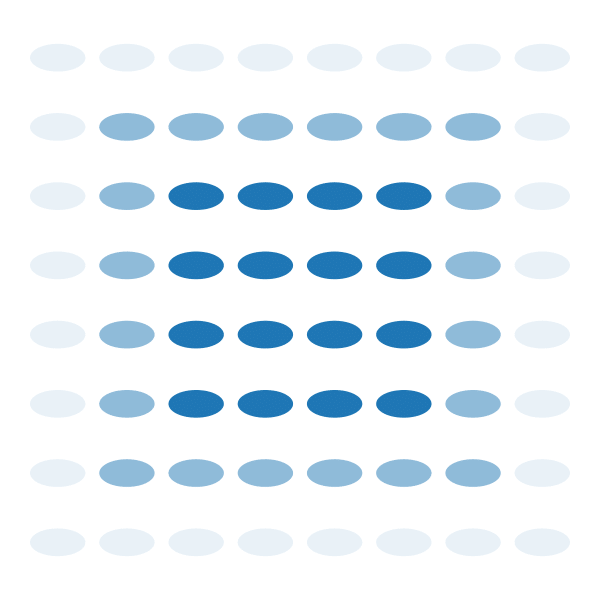
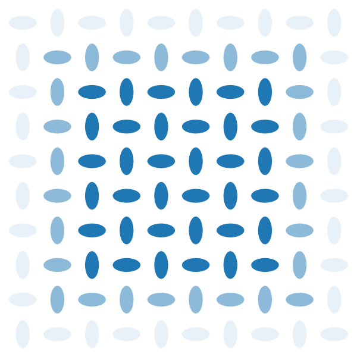
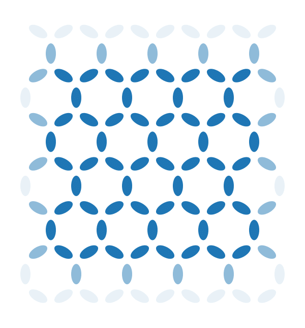

# Hotspice
<!-- markdownlint-disable MD033 -->

Hotspice is a tool for simulating thermally active artificial spin ices, using an Ising-like approximation: the axis and position of each spin is fixed, only their binary state can switch.
The time evolution can either follow the Néel-Arrhenius law of switching over an energy barrier in a chronological manner, or use Glauber dynamics to model the statistical behavior while making abstraction of the time variable.

## Dependencies

To create a new conda environment which only includes the necessary modules for hotspice, one can use the [`environment.yml`](environment.yml) file through the command

```shell
conda env create -n hotspice310 -f environment.yml
```

where `hotspice310` is the name of the new environment (because it uses Python 3.10).

### CuPy

Hotspice relies on the `CuPy` library to provide GPU-accelerated array computing with CUDA for NVIDIA GPUs. When creating a conda environment as shown above, CuPy will be installed automatically.

Note that CuPy will not function properly on systems without CUDA support. On such systems, Hotspice can still be used by using the CPU as shown in [choosing between GPU or CPU](#choosing-between-gpu-or-cpu).

To [install CuPy](https://docs.cupy.dev/en/stable/install.html) separately, the easiest method is likely to use the following `conda` command, as this automatically installs the appropriate version of the CUDA toolkit:

```shell
conda install -c conda-forge cupy
```

## Getting started

Hotspice is designed as a Python module, and can therefore simply be imported through `import hotspice`.
Several submodules provide various components, most of which are optional.
All of the strictly crucial classes and functions are provided in the default `hotspice` namespace, but other modules like `hotspice.ASI` provide wrappers and examples for ease of use.

### Creating a simple spin ice

To create a simulation, the first thing one has to do is to create a spin ice. This can be done by instantiating any of the ASI subclasses from the `hotspice.ASI` submodule, for example a 'diamond' pinwheel geometry:

```python
import hotspice
mm = hotspice.ASI.IP_Pinwheel(1e-6, 100) # Create the spin ice object
hotspice.plottools.show_m(mm) # Display the current state of the spin ice
```

The meaning of the values `1e-6` and `100` requires a small introduction on how the spin ices are stored in memory.
Most data and parameters of a spin ice are stored as 2D CuPy arrays, since this improves efficiency for certain steps in the calculation.
However, this also implies that the possible spin ice geometries are restricted to those that can be represented as a periodic structure on a square grid.
The geometry is then defined by leaving some spots on this grid empty, while filling others with a magnet and its relevant parameters like magnetic moment $M_{sat} V$ (`mm.moment`), energy barrier $E_B$ (`mm.E_B`), temperature $T$ (`mm.T`), orientation...

- The first parameter (`a=1e-6`) specifies a typical distance between two magnets, but the exact meaning of this depends on the spin ice geometry being used, and how it is implemented on a grid.

- The second parameter in the initialization call (`n=100`) specifies the length of each axis of these underlying 2D arrays.
Hence, the spin ice in the example above will have 10000 available grid-points to put a magnet.
However, this 'diamond' pinwheel geometry can only be represented on a grid by leaving half of the available cells empty, so the simulation above actually contains 5000 magnets (see `mm.n`).

- Additional parameters can be used, for which we currently refer to the docstring of `hotspice.Magnets()`. In particular, the `params` parameter accepts a `hotspice.SimParams` instance which can set technical details for the spin ice, e.g. the update/sampling scheme to use, whether to use a reduced kernel...

For details on the grid representation and exact meaning of the 'typical distance' for each of the standard spin ices, see [Available spin ices](#available-spin-ices) or refer to the docstrings.

Examples of usage for each of the ASI lattices, as well as examples of functions operating on these ASI objects, are provided in the 'examples' directory.

### Stepping in time

To perform a single simulation step, call `mm.update()`. The scheme used to perform this single step is determined by `mm.params.UPDATE_SCHEME` (possible schemes: `'Néel'`, `'Glauber'`, `'Wolff'`).

To relax the magnetization to a (meta)stable state, call `mm.relax()` or `mm.minimize()` (the former is faster for large simulations but less accurate, the latter is faster for small simulations and follows the real relaxation order more closely).

### Applying input and reading output

More complex input-output simulations can be performed using the `hotspice.io` and `hotspice.experiments` modules, but these are still under construction.

The `hotspice.io` module contains classes that apply external stimuli to the spin ice, or read the state of the spin ice in some manner.

The `hotspice.experiments` module contains classes to bundle many input/output runs and calculate relevant metrics from them, as well as classes to perform parameter sweeps.

### Performing a parameter sweep on multiple GPUs

The `hotspice/scripts/ParallelJobs.py` script can be used to run a `hotspice.experiments.Sweep` on multiple GPUs. This sweep should be defined in a file that follows a structure similar to `examples/SweepKQ_RC_ASI.py`. Running `ParallelJobs.py` can be done

- either from the command line by calling `python ParallelJobs.py <sweep_file>`,
- or from an interactive python shell by calling `hotspice.utils.ParallelJobs(<sweep_file>)`.

### Choosing between GPU or CPU

*By default, hotspice runs on the GPU.* One can also choose to run hotspice on the CPU instead, e.g. for small simulations with only several tens of magnets, where the parallelism of GPU computing is not quite beneficial.

At the moment when hotspice is imported through `import hotspice`, it

1) checks if the command-line argument `--hotspice-use-cpu` is present. If it is, the CPU is used. Otherwise,
2) the environment variable `'HOTSPICE_USE_GPU'` (default: `'True'`) is checked instead, and either the GPU or CPU is used based on this value.

*When invoking a script* from the command line, the cmd argument can be used. *Inside a python script*, however, it is discouraged to meddle with `sys.argv`. In that case, it is better to set the environment variable as follows:

```python
import os
os.environ['HOTSPICE_USE_GPU'] = 'False' # Must be type 'str'
import hotspice # Only import AFTER setting 'HOTSPICE_USE_GPU'!
```

*Note that the CPU/GPU choice must be made **BEFORE** the `import hotspice` statement* (and can thus be made only once)! <sub><sup>This is because behind-the-scenes, this choice determines which modules are imported by hotspice (either NumPy or CuPy), and it is not possible to re-assign these without significant runtime issues.</sup></sub>

## Available spin ices

Several predefined geometries are available in hotspice.
They are listed below with a small description of their peculiarities.
They all follow the pattern `hotspice.ASI.<class>(a, n, nx=None, ny=None, **kwargs)`, where `n` is only required if either `nx` or `ny` is not specified.

### In-plane

| Class | Lattice | Parameters |
|---|:---:|---|
| `IP_Ising` |  | `a` is the distance between nearest neighbors. The occupation is full. |
| `IP_Square` |  | `a` is the side length of a square, i.e. the side length of a unit cell. The occupation is 1/2. |
| `IP_Pinwheel` |  | Same as `IP_Square`, but with the easy axis of each magnet rotated 45°. |
| `IP_SquareDiamond` |  | Same as `IP_Square`, but the whole grid is rotated 45°, yielding different edges. The occupation is 1. |
| `IP_PinwheelDiamond` |  | Same as `IP_SquareDiamond`, but with the easy axis of each magnet rotated 45°. |
| `IP_Kagome` |  | `a` is the distance between opposing edges of a hexagon. The occupation is 3/8. |
| `IP_Triangle` |  | Same as `IP_Kagome`, but with all magnets rotated 90°. |

### Out-of-plane

| Class | Lattice | Parameters |
|---|:---:|---|
| `OOP_Square` |  | `a` is the distance between nearest neighbors. The occupation is full. |
| `OOP_Triangle` |  | `a` is the distance between nearest neighbors. The occupation is 1/2. |
