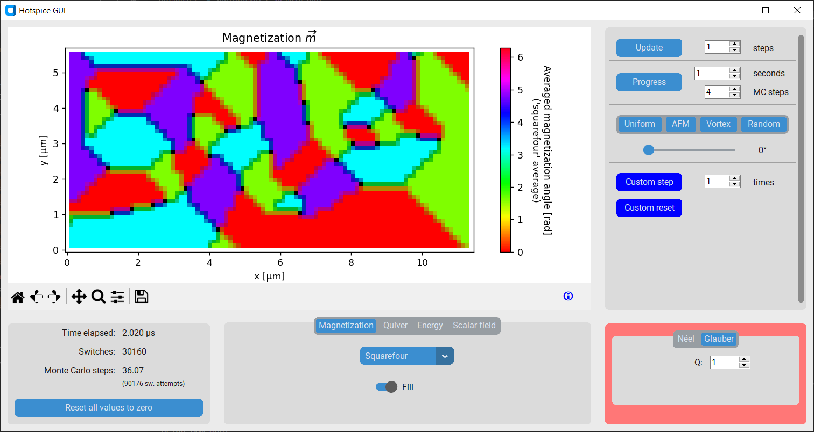

# Hotspice
<!-- markdownlint-disable MD033 -->

**Hotspice is a kinetic Monte Carlo simulation package for thermally active artificial spin ices**, using an Ising-like approximation: the axis and position of each spin is fixed, only their binary state can switch.
The time evolution can either follow the Néel-Arrhenius law of switching over an energy barrier in a chronological manner, or alternatively use Metropolis-Hastings to model the statistical behavior while making abstraction of the time variable.

> [!NOTE]
> Our paper, [The design, verification, and applications of Hotspice: a Monte Carlo simulator for artificial spin ice](https://arxiv.org/abs/2409.05580), provides more details on the model used and model variants implemented.
It also discusses the main examples provided in the `examples/` directory.

1) [Dependencies](#dependencies)

2) [Getting started](#getting-started)

    - [Creating a simple spin ice](#creating-a-simple-spin-ice)
    - [Stepping in time](#stepping-in-time)
    - [Applying input and reading output](#applying-input-and-reading-output)
    - [Performing a parameter sweep on multiple GPUs/CPUs](#performing-a-parameter-sweep-on-multiple-gpuscpus)
    - [Choosing between GPU or CPU](#choosing-between-gpu-or-cpu)

3) [GUI](#gui)

4) [Available spin ices](#available-spin-ices)

## Dependencies

To create a new conda environment which only includes the necessary modules for hotspice, one can use the [`environment.yml`](environment.yml) file through the command

```shell
conda env create -n hotspice310 -f environment.yml
```

where `hotspice310` is the name of the new environment (because it was developed using Python 3.10).

### CuPy (GPU calculation, optional)

*By default, Hotspice runs on the CPU. To use the GPU, see [choosing between GPU or CPU](#choosing-between-gpu-or-cpu).*

On systems with CUDA support, Hotspice can run on the GPU. For this, it relies on the `CuPy` library to provide GPU-accelerated array computing for NVIDIA GPUs. When creating a conda environment as shown above, CuPy will be installed automatically.

If this fails, see the [CuPy installation guide](https://docs.cupy.dev/en/stable/install.html): the easiest method is likely to use the following `conda` command, as this automatically installs the appropriate version of the CUDA toolkit:

```shell
conda install -c conda-forge cupy
```

## Getting started

Hotspice is designed as a Python module, and can therefore simply be imported through `import hotspice`.
Several submodules provide various components, most of which are optional.
All of the crucial classes are provided in the default `hotspice` namespace. Other modules like `hotspice.ASI` provide wrappers and examples for ease of use.

### Creating a simple spin ice

To create a simulation, the first thing one has to do is to create a spin ice. This can be done by instantiating any of the ASI subclasses from the `hotspice.ASI` submodule, for example a 'diamond' pinwheel geometry:

```python
import hotspice
mm = hotspice.ASI.IP_Pinwheel(1e-6, 100) # Create the spin ice object
mm.add_energy(hotspice.ZeemanEnergy(magnitude=1e-3)) # Apply a 1mT field
hotspice.gui.show(mm) # Display a GUI showing the current state of the spin ice
```

- The first parameter (`a=1e-6`) is the lattice parameter in meters, often representing a typical distance between two magnets. The exact definition depends on the lattice used: see [Available spin ices](#available-spin-ices).

- The second parameter (`n=100`) specifies the size of the rectilinear grid upon which the simulation is performed.
  In this example, the 'diamond' pinwheel ASI has 10000 available grid-points, of which 5000 (=`mm.n`) will contain a magnet.

> [!NOTE]
> As explained in [our paper](https://arxiv.org/abs/2409.05580), Hotspice simulations use an underlying grid for efficient calculation. Hence, all ASI in Hotspice are represented as 2D arrays. Note that this implies that the possible spin ice lattices are restricted to those that can be represented as a periodic structure on a square grid. The lattices in [Available spin ices](#available-spin-ices) are defined by leaving some spots on this grid empty, while filling others with the properties of a magnet e.g., magnetic moment, orientation...

- Additional arguments can be provided, for which we mostly refer to the [docstring of `hotspice.Magnets()`](hotspice/core.py#L56). The most important of these are:
  - `moment` (magnetic moment $M_\mathrm{sat} V$), `T` (temperature) and `E_B` (energy barrier $E_\mathrm{B}$) `E_B` of all magnets can be specified as scalars or 2D NumPy (or CuPy) arrays. For ellipsoidal nanomagnets, `hotspice.utils.E_B_ellipsoid()` can provide a basic estimate for `E_B`.
  - The `params` argument is a `hotspice.SimParams` instance, which controls technical aspects of the simulation e.g., the update/sampling scheme to use, when and at what distance to cut off the magnetostatic interaction (achieved by truncating the kernel array)...
  - The `energies` argument is a list of all energies to be considered. By default, only the magnetostatic interaction is considered. `energies` allows the `hotspice.ZeemanEnergy`, `hotspice.ExchangeEnergy` or user-defined energies to be added, or the `hotspice.DipolarEnergy` to be omitted if so desired. See the docstrings of these classes for several energy-specific options like a cut-off distance for the magnetostatic interaction.

Examples of usage for several of the ASI lattices are provided in the 'examples' directory.

### Stepping in time

To perform a single simulation step, call `mm.update()`. The scheme used to perform this single step is determined by `mm.params.UPDATE_SCHEME`, which is an instance of `hotspice.Scheme`. Alternatively, `mm.progress()` can be used to advance the simulation by a given duration in time or a number of Monte Carlo steps.

To relax the magnetization to a (meta)stable state, call `mm.relax()` or `mm.minimize()` (the former is faster for large simulations but less accurate, the latter is faster for small simulations and follows the real relaxation order more closely).

### Reading output and applying input

The full state of the system can be read from the `.m` property of an ASI object, and averages can be obtained through `.m_avg` etc.
Derived quantities like correlations can be calculated using the `._get_nearest_neighbors()` method and the underlying 2D grid.
The properties `.t`, `.MCsteps`, `switches` and `attempted_switches` provide access to the elapsed time or number of Monte Carlo steps performed.

For ease of use, Hotspice provides some utilities to consistently store data: `hotspice.utils.save_results()` and `hotspice.utils.load_results()` are general-purpose functions, while the builtin `Sweep` class for parameter sweeps uses the `hotspice.utils.Data` class to store metadata specific to the simulation.

It is also possible to perform more complex input-output simulations, e.g. for reservoir computing.
For this purpose, the `hotspice.io` module contains classes that apply external stimuli to the spin ice, or read the state of the spin ice in some manner.
The `hotspice.experiments` module contains classes to bundle many input/output runs and calculate relevant metrics from them, as well as classes to perform parameter `Sweep`s.

### Performing a parameter sweep on multiple GPUs/CPUs

The `hotspice/scripts/ParallelJobs.py` script can be used to run a `hotspice.experiments.Sweep` on multiple GPUs or CPU cores. This sweep should be defined in a file that follows a structure similar to `examples/SweepKQ_RC_ASI.py`. Running `ParallelJobs.py` can be done

- either from the command line by calling `python ParallelJobs.py <sweep_file>`,
- or from an interactive python shell by calling `hotspice.utils.ParallelJobs(<sweep_file>)`.

### Choosing between GPU or CPU

*By default, hotspice runs on the CPU.* One can also choose to run hotspice on the GPU instead, e.g. for large simulations with over a thousand magnets, where the parallelism of GPU computing becomes beneficial.

At the moment when hotspice is imported through `import hotspice`, it

1) checks if the command-line argument `--hotspice-use-cpu` or `--hotspice-use-gpu` is present, and act accordingly. Otherwise,
2) the environment variable `'HOTSPICE_USE_GPU'` (default: `'False'`) is checked instead, and either the GPU or CPU is used based on this value.

*When invoking a script* from the command line, the cmd argument can be used. *Inside a python script*, however, it is discouraged to meddle with `sys.argv`. In that case, it is better to set the environment variable as follows:

```python
import os
os.environ['HOTSPICE_USE_GPU'] = 'True' # Must be type 'str'
import hotspice # Only import AFTER setting 'HOTSPICE_USE_GPU'!
```

*Note that the CPU/GPU choice must be made **BEFORE** the `import hotspice` statement* (and can thus be made only once)! <sub><sup>This is because behind-the-scenes, this choice determines which modules are imported by hotspice (either NumPy or CuPy), and it is not possible to re-assign these without significant runtime issues.</sup></sub>

## GUI

A graphical user interface is available to display and interact with the ASI. As shown earlier, it can be run by calling `hotspice.gui.show(mm)`, with `mm` the ASI object.

Buttons in the right sidebar allow the user to interact with the ASI by progressing through time. It is also possible to interact with the ASI at a granular level by clicking on the ASI plot directly (for more info on this, click the blue circled `i` to the bottom right of the ASI). The bottom left panel shows the elapsed time. The bottom central panel is used to change the main ASI view: it is possible to show the magnetization, domains, various energy contributions and barriers, as well as spatially resolved parameters like temperature, anisotropy and magnetic moment.



## Available spin ices

Several predefined geometries are available in hotspice.
They are listed below with a small description of their peculiarities.
They all follow the pattern `hotspice.ASI.<class>(a, n, nx=None, ny=None, **kwargs)`, where `n` is only required if either `nx` or `ny` is not specified.

### In-plane

| Class | Lattice | Parameters |
|---|:---:|---|
| `IP_Ising` |  | `a` is the distance between nearest neighbors. Full occupation. |
| `IP_Square` or `IP_Square_Closed` |  | `a` is the side length of a square, i.e. the side length of a unit cell. 1/2 occupation. |
| `IP_Square_Open` |  | Same as `IP_Square`, but with different edges, because the grid as a whole is rotated 45°. Full occupation. |
| `IP_Pinwheel` or `IP_Pinwheel_Diamond` |  | Same as `IP_Square`, but with each magnet rotated 45°. |
| `IP_Pinwheel_LuckyKnot` |  | Same as `IP_Square_Open`, but with each magnet rotated 45°. |
| `IP_Kagome` |  | `a` is the distance between opposing edges of a hexagon. 3/8 occupation. |
| `IP_Triangle` |  | Same as `IP_Kagome`, but with all magnets rotated 90°. |
| `IP_Cairo` |  | `a` is the side length of a pentagon. `beta` transforms the ice to Shakti, but this is not recommended in the Ising approximation. 1/5 occupation. |

### Out-of-plane

| Class | Lattice | Parameters |
|---|:---:|---|
| `OOP_Square` |  | `a` is the distance between nearest neighbors. Full occupation. |
| `OOP_Triangle` |  | `a` is the distance between nearest neighbors. 1/2 occupation. |
| `OOP_Honeycomb` |  | `a` is the distance between nearest neighbors. 2/5 occupation. |
| `OOP_Cairo` |  | `a` is the distance between nearest neighbors. 3/16 occupation. |

## Package structure

The modules comprising Hotspice can be found in this repository in the directory `hotspice/`.

`core.py` contains the main functionality. It provides the `Magnets` class which forms the heart of Hotspice: it implements the Néel-Arrhenius and Metropolis-Hastings algorithms. `energies.py` contains the 3 standard energy contributions: magnetostatic interaction, the Zeeman energy, and the exchange energy. Classes from both `core.py` and `energies.py` are available in the main `hotspice` namespace, due to their great importance.

`ASI.py` provides subclasses which derive from the `Magnets` class to implement several specific lattices. `config.py` controls the selection of GPU or CPU. `gui.py` implements a Tkinter GUI. The recent addition of the GUI makes many functions in the old `plottools.py` redundant. `utils.py` contains utility functions used throughout the library and in examples, which are often unrelated to ASI. The `io.py` and `examples.py` provide functionality for reservoir computing and performing parameter sweeps.
